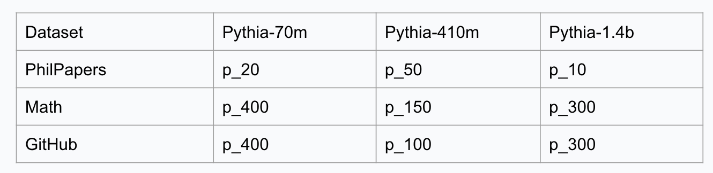

**Student:** Shaheer Abbasi 
**Mentor:** Dr. Michael Reiter  

# Week 3

**Dates:** 06-21 to 06-27

## Goals

- Shift research focus from image classifiers to LLM dataset inference auditing
- Review and comprehend the primary LLM Dataset Inference paper
- Port and set up the corresponding experiments in our Duke compute environment
- Replicate a lightweight version of the dataset inference testing pipeline
- Study the true positive and false positive reporting standards within the paper

## Approach and Implementation

Following our weekly lab meeting with Dr. Reiter, my research shifted toward auditing LLM dataset membership. The focus was to evaluate whether a target model was pre-trained on a specific collection of texts by utilizing dataset-level MIA metrics.

I cloned the study repository onto the Duke compute cluster and configured the setup. This involved setting up a dedicated virtual environment, updating dependency configurations, and resolving minor paths and model-loading conflicts. I also structured Slurm scripts to submit GPU workloads on the cluster.

I made small queries on the PhilPapers and Enron subsets. I generated train and validation metric snapshots, ran the paper’s linear inference routines to compute resulting p-values, and conducted validation-vs-validation false-positive checking.

## Results

- Configured and validated the LLM dataset inference workspace on Duke compute
- Created a functioning Python virtual environment containing the necessary pre-requisites
- Implemented Slurm GPU integration to run large pipeline workloads
- Generated train and validation metric profiles across smaller datasets
- Replicated baseline paper findings: true pre-train matches generated strong inference signals, while validation benchmark splits correctly returned high p-values (no false positives)

<table align="center">
  <tr>
    <td align="center">
      
    </td>
  </tr>
</table>

## Notes

