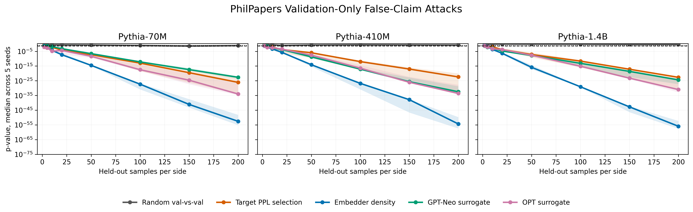
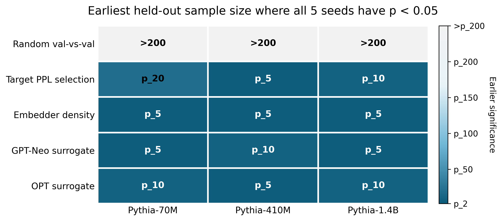

**Student:** Shaheer Abbasi 
**Mentor:** Dr. Michael Reiter  

# Week 4

**Dates:** 06-28 to 07-04

## Goals

- Establish false-claim vulnerability attacks against the LLM dataset inference scheme
- Perform tests using strictly validation dataset samples to evaluate if the auditing method can be falsely triggered
- Assess random validation splits versus deliberately constructed "suspect" splits
- Test target-independent suspect collection structures, utilizing text embeddings and small surrogate language models

## Approach and Implementation

I coordinated with Dr. Reiter to outline strategic approaches for faking pre-training set claims. By filtering and ranking the validation split of the dataset, we aimed to compile a "suspect" database that mirrors pre-trained member statistical distribution, even though they were never used to train the target model.

Initially, I constructed a target-query attack, ranking validation text sequences by high target model posterior metrics (like low perplexity). Because this calls the target model, I subsequently researched target-independent selection techniques.

First, I implemented a semantic density selector. Using sentence-transformers/all-MiniLM-L6-v2, we derived dense cluster regions among embedded text files to pick highly representative samples. Second, I leveraged surrogate models (gpt-neo-125m and opt-125m) to rank by perplexity and extract candidate text blocks.

We executed evaluation sweeps on various Pythia size boundaries (pythia-70m, pythia-410m, pythia-1.4b) and contrasted these against the random baseline splits that the paper used.

## Results

- confirmed that baseline random validation splits do not report membership, matching the paper's default findings
- Verified that target-model metric selectors consistently trigger highly confident false-claim signals
- Validated that target-independent semantic density selectors successfully produce false-membership claims across all three target models
- Confirmed that surrogate-LM suspect sets (via GPT-Neo and OPT) similarly trigger false membership
- Achieved statistical verification significance limits (p_5, p_10, p_20) in PhilPapers false-claim sweeps, while random baselines remained insignificant.

<table align="center">
  <tr>
    <td align="center">
      
    </td>
    <td align="center">
      
    </td>
  </tr>
</table>

## Notes

