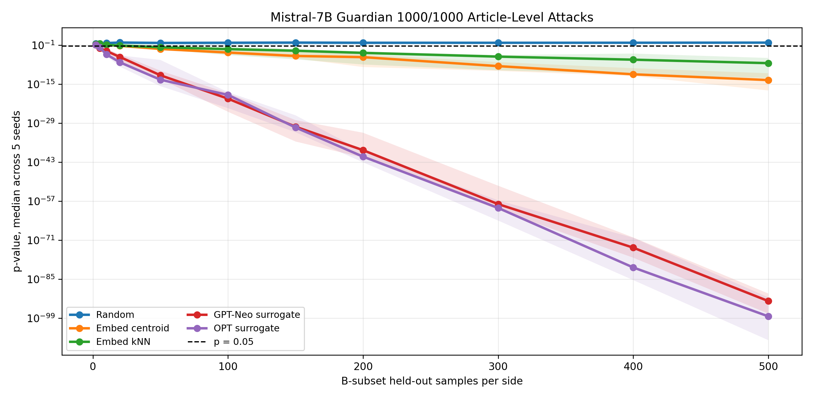
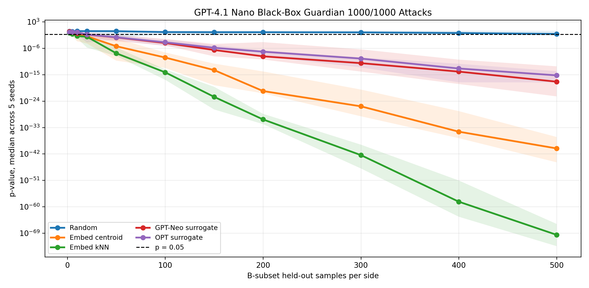
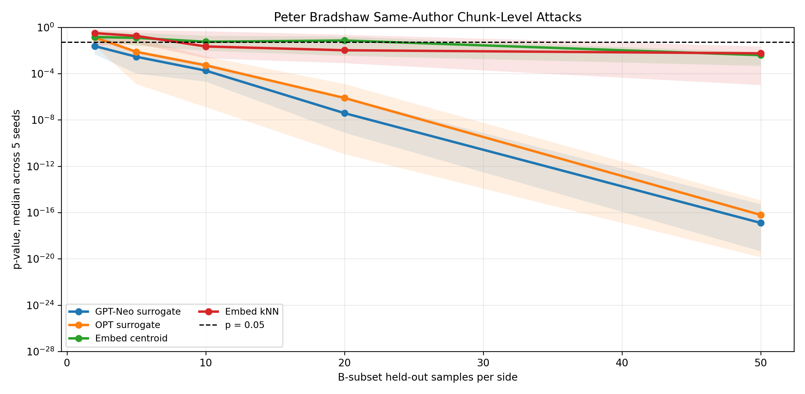
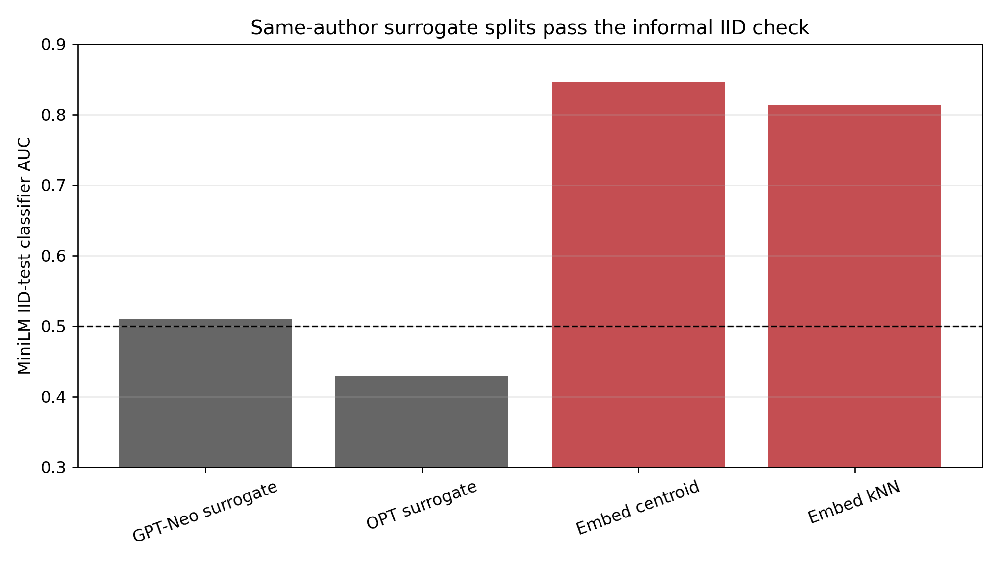

**Student:** Shaheer Abbasi  
**Mentor:** Dr. Michael Reiter  

# Week 5

**Dates:** 07-05 to 07-11

## Goals

- Extend false-claim attacks from Pythia to additional target language models
- Evaluate attack transferability to open-source and commercial LLMs
- Construct suspect sets that satisfy IID distribution requirements
- Develop a scoring approach for black-box models without loss or perplexity access

## Approach and Implementation

Building on prior results showing that adversarial suspect/validation splits can trigger false training-data claims, I extended the attack methodology to models beyond the Pythia family.

I reviewed two recent papers on LLM dataset inference, both of which emphasize that the method requires a private held-out set drawn from the same distribution as the suspect data; a condition that is difficult to satisfy in practice. This motivated formal IID verification as part of the attack pipeline.

I evaluated three data sources: 30 NYT articles published after 2024 across four authors (smoke test), 2,500 Guardian articles from June–July 2026, and 113 articles from a single Guardian author (Peter Bradshaw). Suspect sets were constructed using two target-independent selectors: independent language models (GPT-Neo and OPT) ranked by perplexity, and an embedding-density selector based on MiniLM embeddings.

Only the single-author Guardian dataset, scored with independent LMs, passed the IID distribution check. The embedding-based selector failed the check across all configurations tested.

I executed false-claim attacks against Mistral-7B-v0.1 using the NYT and Guardian datasets. Because Mistral was released in 2023, the 2025–2026 news articles should be post-training non-members.

For GPT-4.1-Nano, the OpenAI API provides black-box access only, preventing direct computation of the MIA features used in the original LLM-DI pipeline. I implemented a substitute metric by extracting the first 80 words of each article as a prefix, generate a continuation from the target model, and compare embedding similarity between the generated text and the true next 80 words, relative to 25 control suffixes from other articles in the same category.

## Results

- Confirmed that the NYT smoke-test dataset produced inference signals on both target models evaluated
- Executed false-claim attacks on Mistral-7B-v0.1 using post-release news data
- Implemented a black-box scoring substitute for GPT-4.1-Nano where standard MIA features are unavailable
- Verified that only same-author, independent-LM suspect sets passed the IID distribution check
- Determined that embedding-density selection failed the IID check across all datasets tested

<table align="center">
  <tr>
    <td align="center">
      
    </td>
    <td align="center">
      
    </td>
  </tr>
  <tr>
    <td align="center">
      
    </td>
    <td align="center">
      
    </td>
  </tr>
</table>

## Notes

