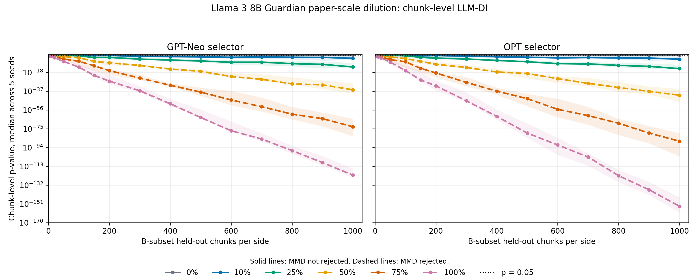

**Student:** Shaheer Abbasi  
**Mentor:** Dr. Michael Reiter  

# Week 6

**Dates:** 07-12 to 07-18

## Goals

- Adapt the false-claim attack to satisfy IID assumptions via distribution-matched suspect sets
- Evaluate the diluted attack against Llama-3-8B
- Review the synthetic held-out dataset inference literature
- Replicate the primary GitHub experiment from the synthetic-DI paper on Duke compute

## Approach and Implementation

Following limited success with commercial LLM targets, I shifted focus to strengthening the attack under IID constraints and to a related method that generates held-out data synthetically rather than requiring a private non-member set.

To pass the Maximum Mean Discrepancy (MMD) distribution test, I implemented a diluted cherry-picking strategy. I selected 2,000 Guardian articles, segmented each into approximately 128-word chunks, and scored only 500 articles (25%) with GPT-Neo and OPT. From each scored article, the lowest-perplexity chunk was assigned to the suspect set and the highest-perplexity chunk to the validation set. The remaining 1,500 articles were partitioned randomly between both sides. This preserved adversarial signal while reducing distributional divergence between suspect and validation sets. I evaluated this configuration against Llama-3-8B as the target model.

In parallel, I studied "Unlocking Post-hoc Dataset Inference with Synthetic Data," which identifies limitations of requiring a real held-out set and proposes generating synthetic controls instead. The method splits each text into a shared prefix with an original suffix (suspect) and a model-generated suffix (control), then trains separate classifiers on text features and MIA features to detect additional membership signal in the combined score.

I began replicating Table 4 from this paper using Pythia-1B on Pile-GitHub suffix pairs (1,000 train + 1,000 test pairs, 10 trials). The 8-bit model loading path produced NaN values on Skynet, so I adapted the pipeline to use FP16 precision. However, the replicated results did not match the paper's claims.

## Results

- Diluted Guardian attack passed MMD verification and produced significant LLM-DI p-values on Llama-3-8B
- Replicated Table 4 on Pile-GitHub: member p-value 0.0000134 (paper: 0.003), nonmember p-value 0.0000217 (paper: 0.07)
- Matched the paper's text-AUC (~53%) and combined-AUC (~56%) separation on GitHub data, but p-values did not match
- Confirmed the synthetic-DI false-claim direction as a viable contribution for our paper

<table align="center">
  <tr>
    <td align="center">
      
    </td>
  </tr>
</table>

## Notes

