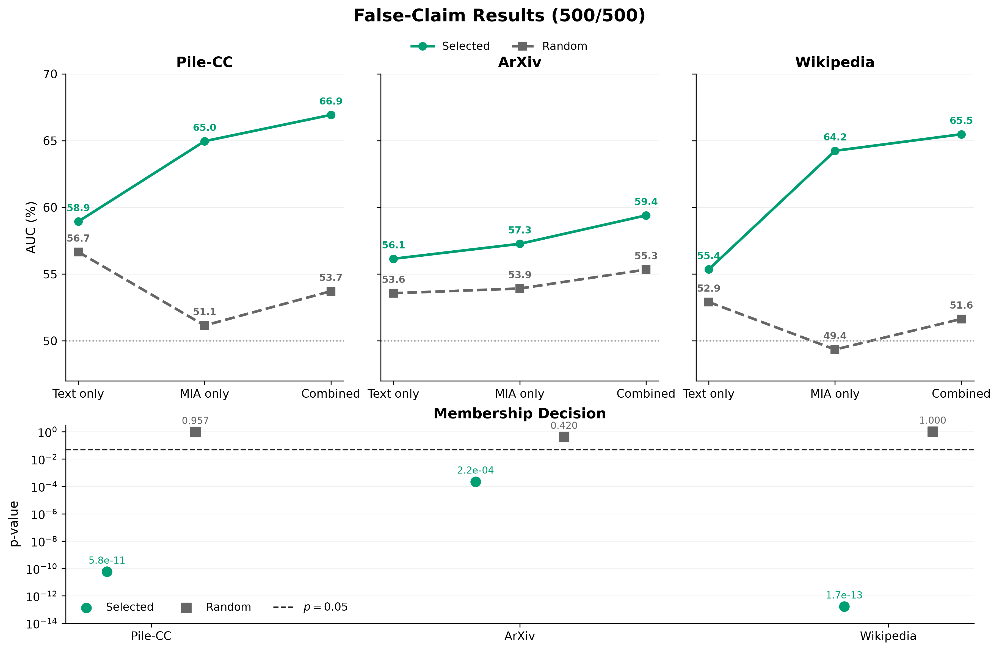
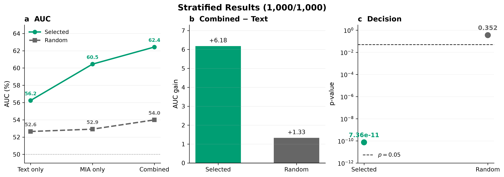

**Student:** Shaheer Abbasi  
**Mentor:** Dr. Michael Reiter  

# Week 7

**Dates:** 07-19 to 07-25

## Goals

- Extend synthetic-DI replication to additional Pile dataset subsets
- Design a false-claim attack targeting the synthetic held-out inference method
- Evaluate whether independent-LM ranking can exploit the two-classifier architecture

## Approach and Implementation

I continued replication of the synthetic dataset inference paper, extending the Table 4 experiment from Pile-GitHub to Pile-CC, Arxiv, and Wikipedia using Pythia-1B. Each run used 1,000 train pairs and 1,000 test pairs across 10 trials, consistent with the prior week's GitHub configuration.

I then constructed a false-claim attack against the synthetic-DI method. For each dataset, I generated real-and-synthetic suffix pairs and ranked only the real suffixes by perplexity using GPT-Neo and OPT. The most predictable real suffixes were assigned to the suspect set, each retained with its paired synthetic control on the validation side.

The attack hypothesis is that a text-only classifier captures standard real-versus-generated differences, while the combined classifier (text features plus MIA features) should show a larger AUC gap if independent-LM selection introduces a transferable membership signal beyond artifact detection alone.

## Results

- Replication results matched the paper across all three additional datasets:
- Pile-CC member: p=1.76e-5, combined AUC +4.13 over text-only; nonmember: p=0.925, no AUC gap
- Arxiv member: p=3.76e-9, combined AUC +7.06; nonmember: p=0.566, no AUC gap
- Wikipedia member: p=0.00769, combined AUC +1.49; nonmember: p=0.993, no AUC gap
- Implemented the false-claim pipeline for real/synthetic suffix pairs with GPT-Neo and OPT ranking

<table align="center">
  <tr>
    <td align="center">
      
    </td>
    <td align="center">
      
    </td>
  </tr>
</table>

## Notes

- Planned next step: extend the attack to Guardian articles using a fine-tuned Llama model

